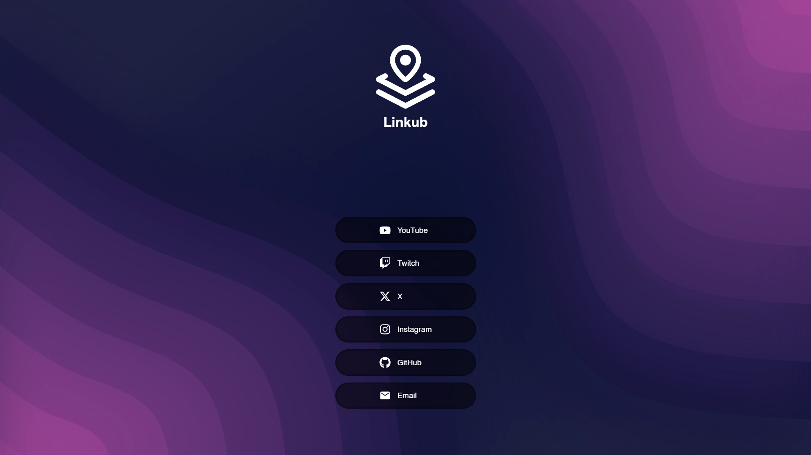

<div align="center">
  

  <h1>Linkub</h1>

  <a href="https://github.com/Minarox/Linkub">Linkub</a> is a simple web page that lists all your links to other sites. <br />
  <a href="https://minarox.github.io/Linkub"><b>Demo »</b></a>

  <div align="center">
    <a href="https://minarox.github.io/Linkub">
      
    </a>
  </div>

  <sub>
    If you like this project, please star it & <a href="https://github.com/Minarox">follow me</a> to see what other cool projects I'm working on! ❤️
  </sub>
</div>

## ⭐️ Features

- 🖼️ **Simple layout** - Easly show and share all of your links
- 🔍 **SEO friendly** - Auto generating tags for better referencing
- 📱 **Responsive** - Already compatible with all screen sizes
- ⚙️ **Configurable** - Change name, description and links with ease

## 🚦 3-step setup

### 1. Clone template

```bash
  git clone https://github.com/Minarox/Linkub
  cd Linkub
```

It is highly recommended to launch the project in the devcontainer to have a pre-configured development environment with dependencies.

### 2. Edit project (variables and assets)

There are two important places to quickly customize the project: `src/assets/svg` and `src/pages/index.astro`.

- **src/assets**

  This folder contains the logo and background image used on the page, in SVG format.

- **src/pages/index.astro**

  This file contains the main configuration to modify for customizing the title, SEO elements, and links displayed on the page:

  ```javascript
    const settings = {
      lang: ["en", "en-US", "English"],

      // Website title
      title: "Linkub",

      // SEO
      description = "All links in one place.",
      keywords = "Linkhub, Link, Social, Media, Hub, Landing, Page, Web",
      creator = "Mathis Serrieres Maniecki",
      xCreator = "Minarox_",
      themeColor = "#0C1136"
    }

    // Links
    const links = [
      {
        name: "GitHub",
        url: "https://github.com"
      },
      {
        name: "Email",
        url: "mailto:contact@example.com",
        // More details in Q&A
        icon: "envelope",
        pack: "mdi"
      }
      ...
    ]
  ```

### 3. Build static files

Ensure that the URL specified in the Astro configuration (`astro.config.mts`) matches the expected URL and generate the website from source files: `pnpm build`.

Congratulation, you have now a landing page with all of your links.
The final website is located inside `build/` and is ready to deploy online!

## 📚 Tech Stack

- [Astro](https://astro.build/)
- [Iconify](https://iconify.design/)
- [Vitest](https://vitest.dev/)

## ⚙️ Scripts

This project use [pnpm](https://pnpm.io) as package manager.
You can also use [npm](https://www.npmjs.com) but you have to edit commands from documentation to make it work properly.

| Command           | Action                                                    |
| :---------------- | :-------------------------------------------------------- |
| `pnpm install`    | Installs dependencies                                     |
| `pnpm dev`        | Starts local dev server at `localhost:4321`               |
| `pnpm check`      | Scan source files for warnings and errors                 |
| `pnpm build`      | Build your production site to `./dist/`                   |
| `pnpm preview`    | Preview your build locally at `localhost:4321`            |
| `pnpm test`       | Run unit tests                                            |
| `pnpm coverage`   | Preview code coverage from unit tests at `localhost:4173` |

## 💁‍♀️ Q&A

### Why another linktree like project?

I needed a simple, lightweight, and easily customizable template to deploy for several side projects.

### How are the links constructed?

The list of links is constructed by following an array of objects:

```typescript
  name: string;
  url: string;
  icon?: string;
  pack?: string;
```

The `name` and `url` associated with the link are required.
The icons used come from the [@iconify-json/fa6-brands](https://icon-sets.iconify.design/fa6-brands/?keyword=fa6) icon pack, using the link name by default to select the displayed icon.

If the default behavior does not suit you, you can force a different icon only from the [@iconify-json/fa6-brands](https://icon-sets.iconify.design/fa6-brands/?keyword=fa6) icon pack by specifying the `icon` field.

If you want to use another icon pack from [iconify](https://icon-sets.iconify.design/), you must use `icon` and `pack` together.
Also, remember to install the library with `pnpm install @iconify-json/...` in the project and restart any instance of Astro previously running.

### How do I deploy the project?

By default, the project includes a workflow to automate the deployment of the website on GitHub Pages from the main branch, but **you need to change the Astro configuration (`astro.config.mts`) to match the expected URL**.

If you want to deploy the website elsewhere, you need to build the project with the command `pnpm build` and deploy the files from `build/` to any web hosting platform that supports static websites.
Please refer directly to the documentation of the relevant platforms.

## 💼 License

MIT © [Mathis Serrieres Maniecki](https://github.com/Minarox)
